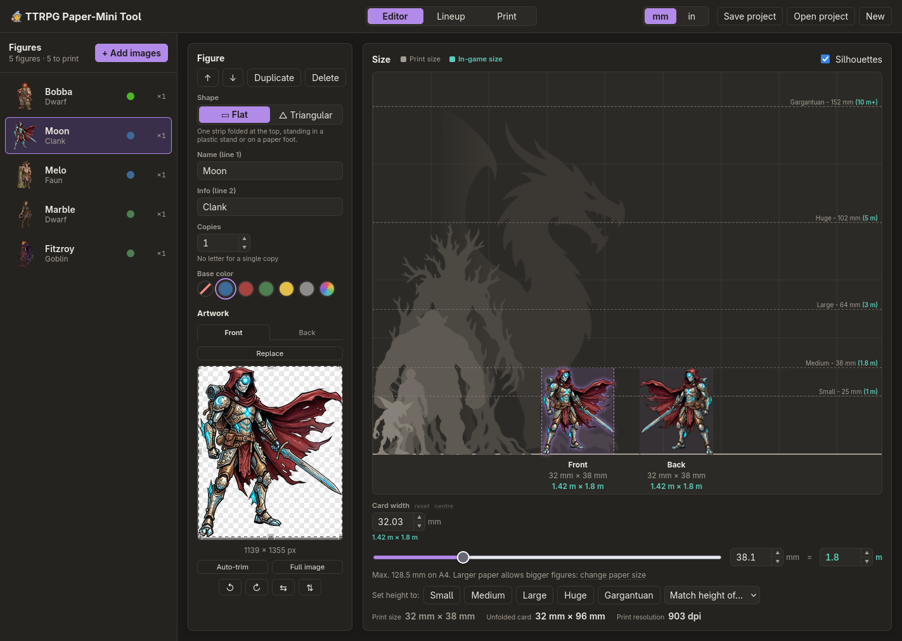
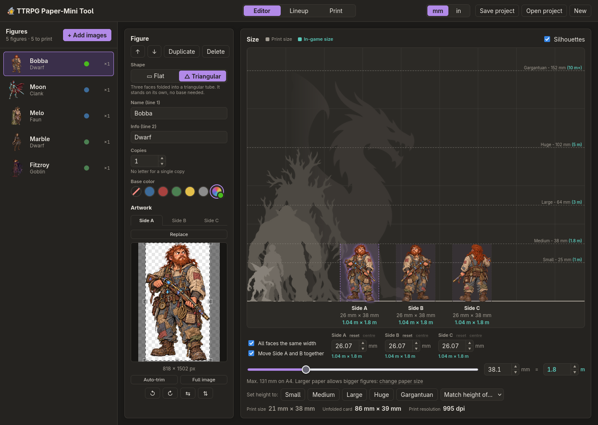
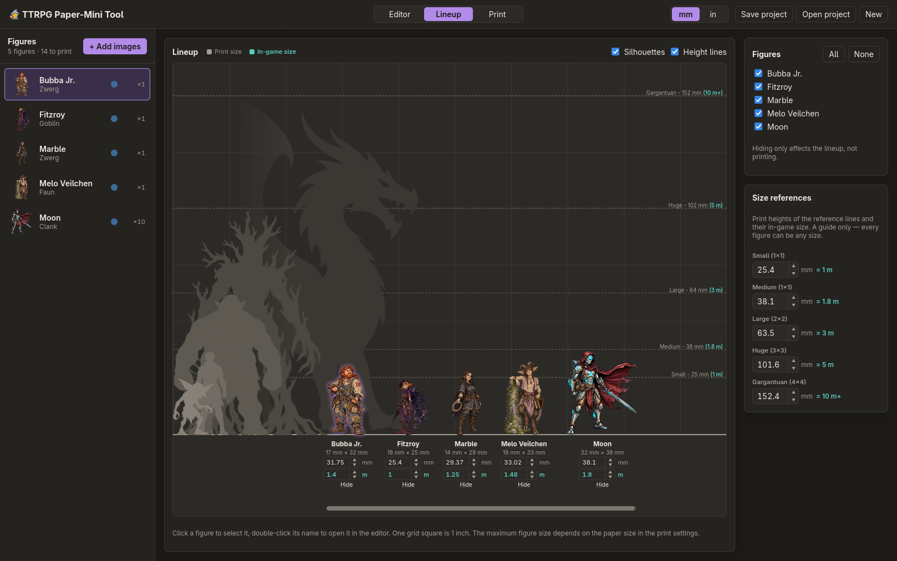
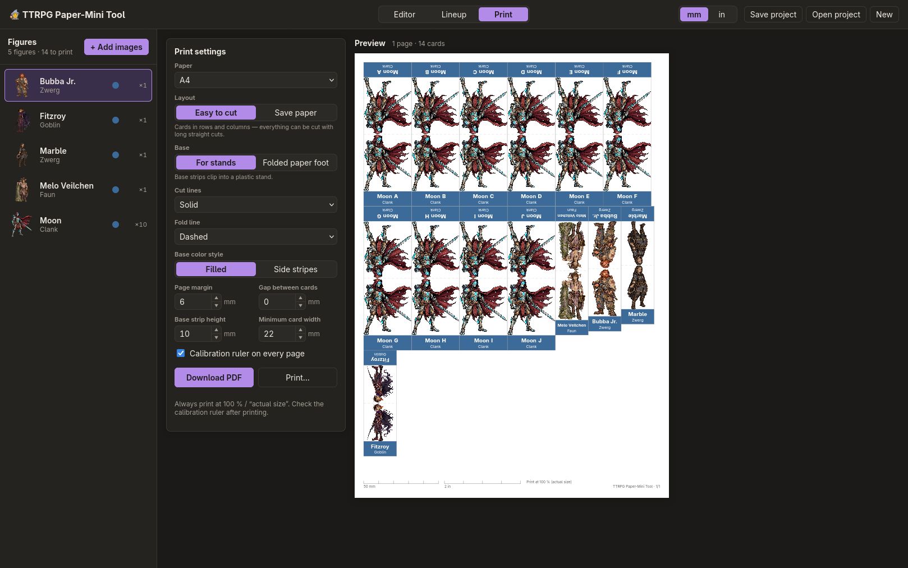

# 🧙 TTRPG Paper-Mini Tool

Turn character and monster images into printable, foldable **paper miniatures** for tabletop RPGs —
right in your browser. Works for Daggerheart, D&D, Pathfinder or any other game played on a 1-inch grid.

Print them **flat** for plastic stands or a folded paper foot, or **triangular** as a small tube that
stands on its own and shows the figure from the front, both front corners and the back.

Your images never leave your computer: everything runs locally in the browser.

## Screenshots

| Editor — flat mini | Editor — triangular mini |
| --- | --- |
|  |  |
| **Lineup — match sizes on a battle map grid** | **Print — layout, options and live preview** |
|  |  |

## How a paper mini works

### Flat

One strip that you cut out and fold at the top:

```
+-------------+  base strip (back)   <- text upside down, reads correctly from behind
|   image     |  back image, upside down
+- - fold - - +
|   image     |  front image
+-------------+  base strip (front)  <- name + info, goes into the stand
```

After folding, the figure shows the artwork on both sides and the base strip clips into a small plastic stand.
Without a back image of its own, the back shows the front mirrored, as if you were looking at the figure
from behind.

No stands? Choose **Folded paper foot**: both base strips bend out 90° into a foot, and an extra flap
(twice the strip length) folds under it as reinforcement.

### Triangular

Three faces in a row, folded into a triangular tube that stands on its own — no stand needed:

```
+-------------+-------------+-------------+\
|   Side A    |   Side B    |   Side C    | |  glue tab
|   (main)    |             |             | |
+-------------+-------------+-------------+/
|  optional band: name and colour         |
+-----------------------------------------+
```

Side A and Side B meet in a fold at the figure's front edge, so it faces you from either side of it, and
the glued seam closes the tube behind. Each face takes its own image, or stays blank; *Use main* puts the
main image on one, mirrored. A face can be made wider than its artwork — needed when one image is much
wider than the others, or the tube will not close — and the artwork is then dragged across it.
No glue at hand? Switch the tab off and close the tube with a piece of tape.

## Features

- **Drag & drop** images anywhere into the window, or use *Add images*.
- **Auto-trim**: transparent (or plain-coloured) borders are removed automatically; fine-tune with the crop tool.
- **Flat or triangular**, switchable per figure.
- **Separate artwork per side**: a back image for flat minis; Side A, B and C for triangular ones.
  Start a side from the main image with one click, then rotate it in 90° steps or mirror it.
- **Size by eye**: compare each figure with reference silhouettes (Small, Medium, Large, Huge, Gargantuan)
  and scale it with a slider. The aspect ratio is always kept, and every side of the figure is shown at once.
- **Lineup view**: see all figures side by side on a battle map grid and match their sizes;
  switch between front and back, and toggle individual figures, silhouettes and height lines.
- **Copies with letters**: print *Goblin A, B, C…* so identical enemies are easy to tell apart.
- **Base colours**: blue, red, green, yellow, gray or any colour from the colour picker, which remembers the
  ones you used. Filled or as side stripes; the text colour adapts for contrast.
- **Two text lines** (name + info) on the base of flat minis — or none at all.
- **Triangular minis** get a band along the bottom instead of a base: name and colour, colour only, colour
  marks at the folds, or nothing — on whichever of the three faces you pick. Face widths can be set by
  hand or kept equal, with a warning when one face grows too wide for the tube to close.
- **Two layouts** on A5, A4, A3, US Letter, US Legal or Tabloid: *Easy to cut* (straight cuts only) or *Save paper* (tight packing).
- **In-game size** of every figure in metres and feet (Small 1 m / 3.28 ft, Medium 1.8 m / 5.91 ft,
  Large 3–5 m / 9.84–16.4 ft, Huge 5–10 m / 16.4–32.81 ft, Gargantuan 10 m+ / 32.81 ft+).
- **Base styles** for flat minis: for plastic stands or as a folded paper foot.
- **Cut and fold line styles**: solid, dashed, corner marks, edge ticks or none.
- **PDF download or direct printing**, with a live preview, page numbers and a calibration ruler.
- **mm or inches** throughout.
- **Projects** are saved automatically in the browser and can be exported/imported as a file.

## Tips

- Transparent PNGs give the best results.
- Always print at **100 % / “actual size”** and check the calibration ruler on the page.
- Heavier paper (160–250 g/m²) makes sturdier minis — and triangular ones stand firmer on it.

## Development

Requires [Node.js](https://nodejs.org/) 22.12 or newer (the test runner needs it).

```sh
npm install
npm run dev        # start the dev server at http://localhost:5173
npm test           # run unit tests
npm run build      # type-check and build static files into dist/
```

Tech stack: [Vite](https://vite.dev/), [React](https://react.dev/), TypeScript, [Zustand](https://github.com/pmndrs/zustand),
[pdf-lib](https://pdf-lib.js.org/) and [react-image-crop](https://github.com/dominictobias/react-image-crop).

### Project structure

```
src/
  lib/          framework-independent logic
    geometry.ts   card and figure dimensions
    sides.ts      a figure's artwork per side: crop, rotation and mirroring
    layout.ts     packs cards onto pages
    render.ts     draws pages onto a canvas (used for preview, PDF and printing)
    output.ts     PDF export and browser printing
    image.ts      image import and auto-trim
  components/   React UI (editor, lineup, print view, ...)
  store.ts      application state and persistence
```

## Credits

Made by [cookie-rain](https://github.com/cookie-rain), built with [Claude Code](https://claude.com/claude-code).

## License

[MIT](LICENSE)
